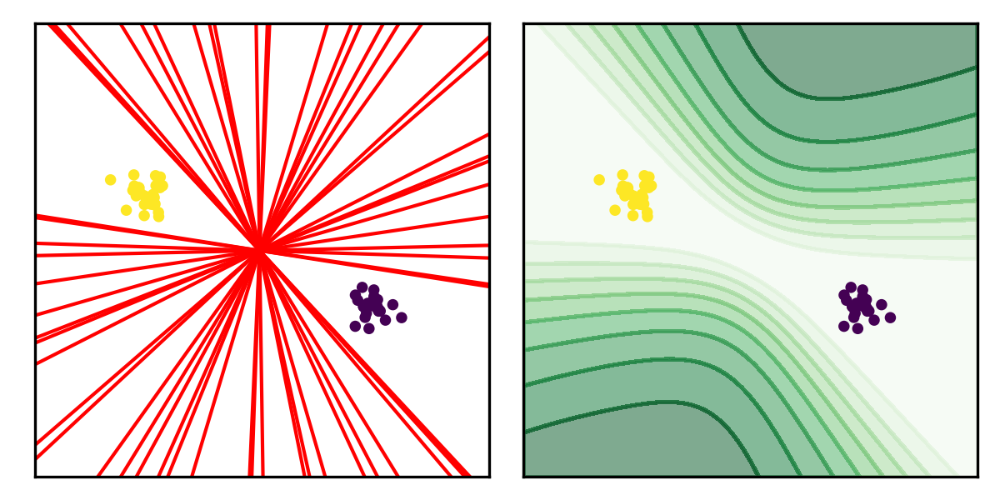

# Reliable JPEG Forensics via Model Uncertainty

Code for "Benedikt Lorch, Anatol Maier, Christian Riess. *[Reliable JPEG Forensics via Model Uncertainty](https://faui1-files.cs.fau.de/public/publications/mmsec/2020-Lorch-BLR.pdf)*. IEEE Workshop on Information Forensics and Security, 2020."



## Prerequisites

* Python packages (available from PyPI): `pip install numpy pandas tqdm h5py matplotlib Pillow imageio`
* *DCT coefficient decoder* for decoding DCT coefficients from JPEG-compressed images. Please follow the instructions from the [GitHub repository](https://github.com/btlorch/dct-coefficient-decoder).
* Optional: To create JPEG images with custom compression settings, open `utils/constants.py` and change the paths to your local *cjpeg* and *djpeg* executables. 

For example:
```
constants[LIBJPEG_CJPEG_EXECUTABLE_KEY] = "~/i1/libjpeg/jpeg-9a/build/bin/cjpeg"
constants[LIBJPEG_DJPEG_EXECUTABLE_KEY] = "~/i1/libjpeg/jpeg-9a/build/bin/djpeg"
```

## Toy example

An illustration of the Bayesian logistic regression classifier on a 2-D toy example is provided in `bayesian_logistic_regression/toy_example.ipynb`. This notebook includes:
* Standard logistic regression
* Bayesian logistic regression with isotropic prior covariance
* Bayesian logistic regression with full prior covariance

## Data

1. Download TIF images from [RAISE-1k dataset](http://loki.disi.unitn.it/RAISE/confirm.php?package=1k).

2. Run `create_data.py` to create datasets of single- and double-compressed images with different pairs of quality factors.

Example:
```bash
cd data
PYTHONPATH=~/i1/reliable-jpeg-forensics python create_dataset.py \
    --image_root $HDD/raise1k/raw_images \
    --output_dir $HDD/jpeg-double-compression
```

This will store an HDF5 file named `%Y_%m_%d-benfords_law_features.h5` to the given output directory.

## Training and testing the Bayesian logistic regression classifier

The experiments folder contains an example how to train and test the Bayesian logistic regression classifier with isotropic prior (`eval_qf2_mismatch_iso_prior.py`) and with full covariance prior (`eval_qf2_mismatch_full_covariance_prior.py`).
In this experiment, we train one classifier for each pair of quality factors `(qf1, qf2_train)` and evaluate the trained classifier on pairs of quality factors `(qf1, qf2_test)`. For each detector, we keep track of the in-distribution test accuracy, out-of-distribution accuracy, and out-of-distribution AUC. The results are stored to a csv file in the given output or data directory.

Usage:

```bash
python eval_qf2_mismatch_full_covariance_prior.py
    --prior_scale PRIOR_SCALE
    --data_filename DATA_FILENAME
    --data_dir DATA_DIR
    [--num_repeats NUM_REPEATS]
    [--output_dir OUTPUT_DIR]
    [--no_scale_mean]
```

Required arguments:
* `prior_scale`: Scale factor for covariance-based prior. You can specify multiple values to create detectors with different scale factors.
* `data_filename`: Filename of HDF5 file containing the first-digit features.
* `data_dir`: Path to directory where the HDF5 features file is located.

Optional arguments:
* `--num_repeats`: How many detectors to train on random in-distribution-data splits (default: 10).
* `--output_dir`: Directory where to store the results. By default uses the given `data_dir`.
* `--no_scale_mean`: Flag that disables scaling the training data to zero-mean.

Example:
```bash
cd experiments
PYTHONPATH=~/i1/reliable-jpeg-forensics/ python eval_qf2_mismatch_full_covariance_prior.py \
    --prior_scale 1e3 \ 
    --data_dir $HDD/jpeg-double-compression \
    --data_filename 2020_12_23-benfords_law_features.h5
```

From the results you can inspect the in-distribution test accuracy and the ability to detect images with unknown qualities as follows:
```python
import pandas as pd

# Read results
df = pd.read_csv("2020_12_23-eval_qf2_mismatch_single_positive_class_full_covariance_prior.csv")

# Calculate the in-distribution test accuracy
# 1) We restrict ourselves to images of full resolution only
# 2) The test data must use the same quality as the training data to evaluate the in-distribution accuracy.
# 3) We exclude the case where qf1 = qf2.
df[(df["crop"] == "full_resolution") & (df["qf2_train"] == df["qf2_test"]) & (df["qf1"] != df["qf2_test"])] \
    .groupby(["qf1", "qf2_test"])["ind_accuracy"].agg("mean").mean()

# Check the ability to recognize images with unseen qf2
# 1) We restrict ourselves to images of full resolution only
# 2) The test data must use a different quality qf2_test to the training quality qf2_train
df[(df["crop"] == "full_resolution") & (df["qf2_train"] != df["qf2_test"])] \
    .groupby(["qf1", "qf2_train", "qf2_test"])["auc"].agg("mean").mean()
```

## Reproducibility

* Image *r0bf7f938t.TIF* appears to be incomplete. We found that different system configurations may decode this image differently.
* At test time, we use Monte Carlo sampling to approximate the predictive distribution. This involves drawing random samples from the weight posterior. 
